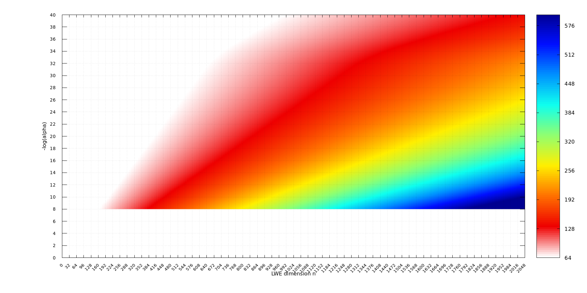

# LWE Estimates

Using `lattice-estimator` by Albrecht et al. [1,2], we calculated the bit-security of TLWE with standard deviation of noise denoted by $\alpha$ and dimension denoted by $n$ (assuming 64-bit Torus representation); see the resulting graph below.

The source values are given in `lwe-security-db.yaml` in a form of $(n, -\log(\alpha))$ pairs, the file `lwe-security__n=128-32-2048_mla=8-2-40.dat` serves as a data source for the graph.

### Previous Version: LWE Estimator

Using *LWE Estimator* by Albrecht et al. [3], we calculated the bit-security of TLWE with standard deviation of noise denoted by $\alpha$ and dimension denoted by $n$ (assuming 64-bit Torus representation); see the resulting graph below.

The source values are given in `__old__lwe-security-db.yaml` in a form of $(n, -\log(\alpha))$ pairs, the file `__old__lwe-security__n=128-32-2048_mla=8-2-40.dat` serves as a data source for the graph.

### References

[1] Martin R Albrecht, Rachel Player, and Sam Scott. On the concrete hardness of learning with errors. *Journal of Mathematical Cryptology*, 9(3):169–203, 2015.

[2] Martin R Albrecht et al. Security Estimates for Lattice Problems. [https://github.com/malb/lattice-estimator](https://github.com/malb/lattice-estimator), 2023.

[3] Martin R Albrecht, Benjamin R Curtis, Amit Deo, Alex Davidson, Rachel Player, Eamonn W Postlethwaite, Fernando Virdia, and Thomas Wunderer. LWE Estimator. [https://bitbucket.org/malb/lwe-estimator](https://bitbucket.org/malb/lwe-estimator), 2018.
