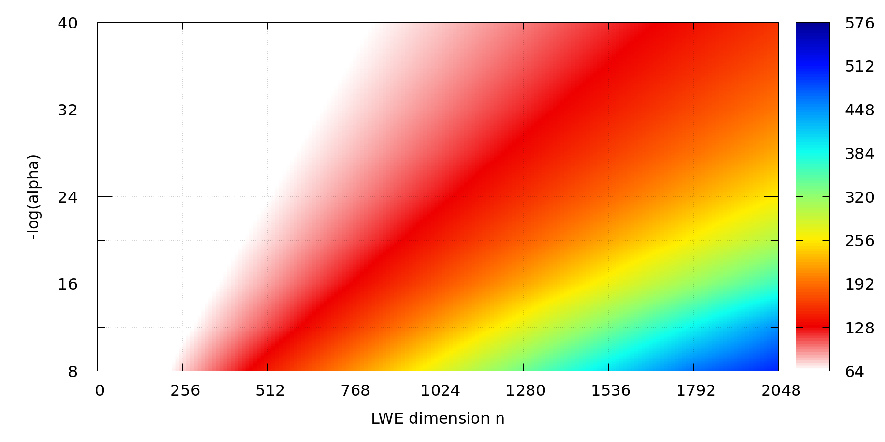
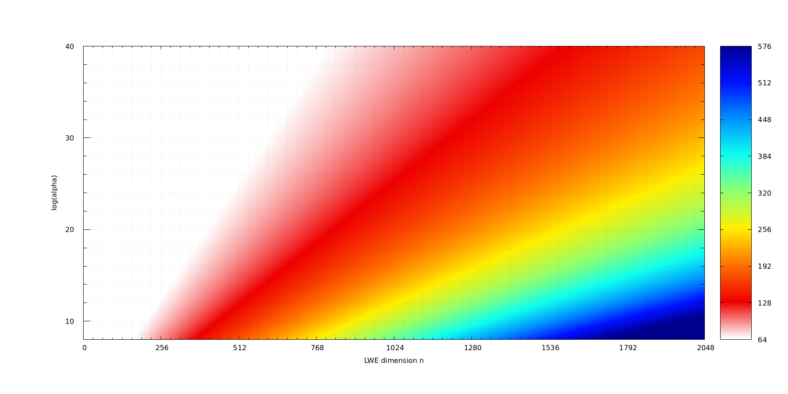

# LWE Estimates

Using `lattice-estimator` by Albrecht et al. [1,2] (commit `f9dc7c`), we evaluate the estimated bit-security of (R)LWE over the torus, considering a finite, 64-bit representation of the torus.
Internally, we run the following estimator code:
```sage
import sys
# lattice-estimator & this repo are expected to live next to each other:
sys.path.append("../lattice-estimator/")

from estimator import *
from estimator.lwe_parameters import LWEParameters
from estimator.nd import NoiseDistribution as ND

LWE.estimate(LWEParameters(n=1024, q=2^64, Xs=ND.Uniform(0,1),
    Xe=ND.DiscreteGaussianAlpha(2^-24, 2^64), m=sage.all.oo))
```
which gives at output:
```
bkw                  :: rop: ≈2^211.1, m: ≈2^196.6, mem: ≈2^197.6, b: 3, t1: 0, t2: 50, ℓ: 2, #cod: 955, #top: 0, #test: 69, tag: coded-bkw
usvp                 :: rop: ≈2^125.2, red: ≈2^125.2, δ: 1.004506, β: 334, d: 1875, tag: usvp
bdd                  :: rop: ≈2^147.9, red: ≈2^115.5, svp: ≈2^147.9, β: 299, η: 454, d: 1782, tag: bdd
bdd_hybrid           :: rop: ≈2^271.9, red: ≈2^116.4, svp: ≈2^271.9, β: 299, η: 898, ζ: 0, |S|: 1, d: 3065, prob: 1, ↻: 1, tag: hybrid
bdd_mitm_hybrid      :: rop: ≈2^523.4, red: ≈2^522.6, svp: ≈2^522.1, β: 299, η: 2, ζ: 374, |S|: ≈2^185.8, d: 2691, prob: ≈2^-404.2, ↻: ≈2^406.4, tag: hybrid
dual                 :: rop: ≈2^128.0, mem: ≈2^71.4, m: 948, β: 340, d: 1972, ↻: 1, tag: dual
dual_hybrid          :: rop: ≈2^122.3, mem: ≈2^118.3, m: 909, β: 319, d: 1880, ↻: 1, ζ: 53, tag: dual_hybrid
{'arora-gb': rop: ≈2^inf, dreg: ≈2^inf, tag: arora-gb, /other values omitted/}
```

As the decisive security estimate, we take the lowest `rop` value -- the documentation of the estimator (e.g., in `/estimator/lwe_guess.py`) states:
```
rop: Total number of word operations (approx. CPU cycles)
```
i.e., from the previous output, we read 122.3 bits of security, due to the `dual_hybrid` attack.

In the graph below, we provide security estimates for noise values between 2^-8 .. 2^-40 (standard deviation of noise denoted alpha; log-scale) and for dimension n between 0 .. 2048.
Note that values are interpolated between grid points.



The source values can be found in `lwe-security-db.yaml` in a form of (n, -log(alpha)) pairs, the file `lwe-security__n=0-256-2048_mla=8-4-40.dat` serves as a data source for the graph.


### Previous Version: LWE Estimator

For reference, we provide a similar graph for the predecessor of `lattice-estimator`, named `LWE Estimator` [3] (also by Albrecht et al.).
Note that the new estimator assumes a broader range of attacks, hence the new estimates are *lower* than with the old one.




### References

[1] Martin R Albrecht, Rachel Player, and Sam Scott. On the concrete hardness of learning with errors. *Journal of Mathematical Cryptology*, 9(3):169–203, 2015.

[2] Martin R Albrecht et al. Security Estimates for Lattice Problems. [https://github.com/malb/lattice-estimator](https://github.com/malb/lattice-estimator), 2023.

[3] Martin R Albrecht, Benjamin R Curtis, Amit Deo, Alex Davidson, Rachel Player, Eamonn W Postlethwaite, Fernando Virdia, and Thomas Wunderer. LWE Estimator. [https://bitbucket.org/malb/lwe-estimator](https://bitbucket.org/malb/lwe-estimator), 2018.
